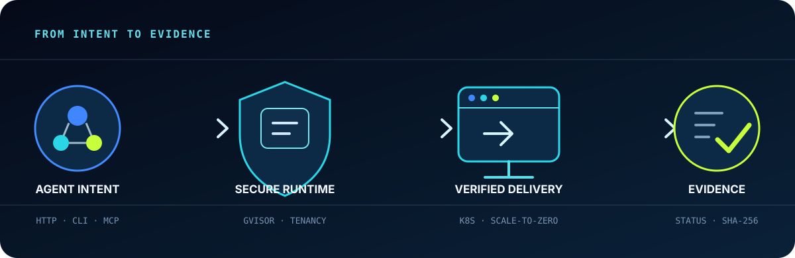
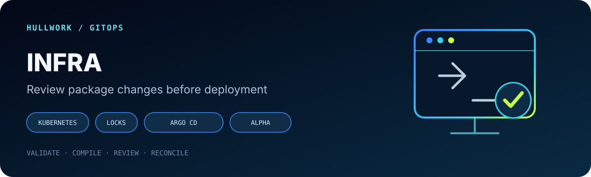

  

  <a href="https://hullwork.github.io/#infra"><strong>Infra · Public Alpha ↗</strong></a>
  &nbsp;&nbsp;·&nbsp;&nbsp;
  <a href="https://hullwork.github.io/sandbox/"><strong>Sandbox website ↗</strong></a>
  &nbsp;&nbsp;·&nbsp;&nbsp;
  <a href="https://hullwork.github.io/site/"><strong>Site website ↗</strong></a>
  &nbsp;&nbsp;·&nbsp;&nbsp;
  <a href="https://github.com/orgs/hullwork/repositories"><strong>Source repositories</strong></a>

## Infrastructure for agents that do real work

Hullwork builds open, self-hosted infrastructure for AI agents that need to execute code and ship software—not just generate an answer.

> **An agent is dependable only when its execution boundary and delivery evidence are explicit.**

Choose the project for your workload: Sandbox provides isolated execution, Site verifies website delivery, and Infra validates Kubernetes package composition before deployment. Each project can be adopted independently.

The execution and delivery path:

`agent request` → **secure execution** → **verified deployment** → `observable result`

  

## Three independent projects

  

### [Sandbox](https://github.com/hullwork/sandbox) — Secure execution for AI agents

Run an agent's shell and file operations inside a dedicated Kubernetes `gVisor` Pod. The self-hosted control plane manages durable workspaces, tenant-scoped credentials, quotas, checkpoints, and runtime lifecycle—without ever falling back to host execution.

**Interfaces:** Python SDK · CLI · MCP &nbsp; | &nbsp; **Proof:** [architecture](https://github.com/hullwork/sandbox#sandbox-platform) · [benchmarks](https://github.com/hullwork/sandbox/blob/main/docs/BENCHMARK_REPORT_2026-09-01.md) · [live project site](https://hullwork.github.io/sandbox/)

  

### [Site](https://github.com/hullwork/site) — Verified website delivery for AI agents

Turn an agent's deployment request into a real Kubernetes workload through HTTP, CLI, or MCP. The control plane handles tenancy, quotas, builds, ingress, observability, and scale-to-zero—then makes a real HTTP request and records the status code and body digest.

**Interfaces:** HTTP API · CLI · MCP &nbsp; | &nbsp; **Proof:** [architecture](https://github.com/hullwork/site#site) · [one-command demo](https://github.com/hullwork/site#see-the-proof-locally) · [live project site](https://hullwork.github.io/site/)

  

### [Infra](https://github.com/hullwork/infra) — Review package changes before deployment

Compose a package catalog, stack, cluster profile, and version lock into deterministic Argo CD ApplicationSet or Application YAML. Infra checks schemas, artifact locks, and per-cluster capability dependencies offline. Review the generated Git change, then let your existing Argo CD installation reconcile it.

**Independent by design:** no controller, companion repository, or Lima management cluster is required for the existing-Argo-CD path. Package owners keep their charts and application logic; operators own environment configuration. Capability validation checks declared records, not live cluster readiness.

**Status:** [Public Alpha · v0.1.0-alpha.3](https://github.com/hullwork/infra/releases/tag/v0.1.0-alpha.3). Start with the [working HTTP example](https://github.com/hullwork/infra/tree/main/examples/hello), follow the [existing Argo CD guide](https://github.com/hullwork/infra/blob/main/docs/EXISTING_ARGOCD.md), and inspect the [tested scope and limitations](https://github.com/hullwork/infra/blob/main/docs/RELEASE_READINESS.md).

## What we optimize for

| Principle | Engineering consequence |
| --- | --- |
| **Boundaries over promises** | Untrusted code runs with explicit identity, resource, network, and runtime isolation. |
| **Evidence over status labels** | A deployment is successful only when the running address has been measured. |
| **Fail closed** | Missing control-plane or runtime dependencies never become permission to execute on the host. |
| **Composable interfaces** | HTTP APIs, CLIs, SDKs, and MCP tools keep products useful without hidden coupling. |
| **Operator ownership** | Workspaces, credentials, state, and deployment infrastructure stay in your environment. |

## Start with the boundary you need

- Need to execute agent-generated code safely? Start with **[Sandbox](https://github.com/hullwork/sandbox#one-command-to-see-the-point)**.
- Need to turn a generated site into a verified deployment? Start with **[Site](https://github.com/hullwork/site#see-the-proof-locally)**.
- Need to validate package composition before Argo CD sync? Start with **[Infra](https://github.com/hullwork/infra#quick-start)**.
- Evaluating the architecture? Read each repository's explicit **known limitations** before adopting it.

## Build with us

Try a project with a real workload and tell us where the first run gets confusing. For Infra, we especially welcome external package examples, clearer validation errors, and reproducible OCI or remote-cluster acceptance runs. [Read the contribution guide](https://github.com/hullwork/infra/blob/main/CONTRIBUTING.md) and [bring a use case or issue](https://github.com/hullwork/infra/issues).

  Build the boundary. Measure the result.

